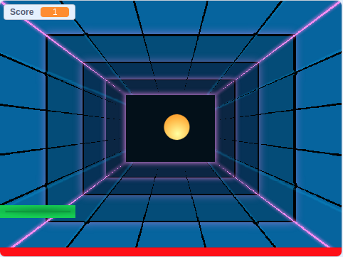

# Boas vindas ao repositório de lógica de programação com Scratch

## O que vamos fazer
Vamos praticar nossa logica de programação desenvolvendo um joguinho chamado Pong Game.

## O que vamos aprender
  * Pensamento Computacional; 
  * Lógica de Programação;
  * Trabalho em equipe; 
  * Criatividade. 

## Requisitos
### 1. Criando o cenário.
  * Criar um backdrop;
  * Incluir os 2 principais elementos do jogo (ball e paddle). 

### 2. Criando a movimentação da bola (ball).
  * Fazer a bola se movimentar pelo espaço. (Dica: em events, encontre o forever);
  * Fazer a bola não ultrapassar o limite do background. (Dica: você pode encontrar esse bloco na lista de blocos “motion”, ele é uma condição “if”);
  * Ainda na sessão “motion” incluir uma quantidade de “passos” que a bola pode dar (Dica: pode ser 15 passos);  
  * Em direction (lado direito da página) determine um ângulo para a movimentação da bola. (Dica: quando ela bater na borda vai voltar inclinada em um ângulo). 

### 3. Criando a movimentação da plataforma (paddle)
  * Fazer o paddle se movimentar horizontalmente (eixo x) de acordo com o movimento do mouse. (Dica: aqui você vai precisar de blocos que se encontram em motion e em sensing); 
  * Fazer o paddle não ultrapassar o limite do background. 

### 4. Desvio da bola ao encontrar o paddle
  * Criar um bloco condicional “if”;
  * Incluir no bloco criado acima as seguintes ações:
      * Se a bola tocar no paddle, ela deve se mover 180° à direita;
      * E se mover a mesma quantidade de passos delimitada na parte II.  

### 5. Criação de variáveis
  * Criar uma variável com o nome “Score”. 
  * Incluir a variável criada em um bloco de mudança de valor da variável. 

### 6. Incrementador de pontos
  * Somar 1 à variável “Score” sempre que a bola tocar o paddle; 
  * Fazer a variável “Score” começar sempre com 0. 

### 7. Decrementador de pontos 
  * Incluir uma linha vermelha horizontal na base do backdrop; 
  * Subtrair 1 da variável “Score” sempre que a bola tocar a linha vermelha.  

### 8. Fim de jogo
  * Fazer com que se o número de pontos do jogador for menor que 0, apareça uma mensagem na tela dizendo que o jogo acabou. 

### BÔNUS

### 9. Excesso de contagens
  * Você deve ter notado que os pontos são contados muitas vezes a mais se a bola bate na borda do background e volta para o paddle em sequência repetidamente. Ou seja, são  acrescentados muitos pontos de uma vez (deveria ser apenas um ponto para cada vez que a bola bate no paddle). Aqui você vai resolver isso.
  * Criar um bloco que faça a bola esperar alguns segundos antes de se mover. 

### 10. Próxima fase
  * Mudar o backdrop se o Score for maior que 10. 
  * Mudar a cor da bola se o Score for maior que 15.
  * Criar uma alteração no jogo se o Score for maior que 20. (Atenção: não vale trocar a cor da bola, trocar o cenário, aumentar/diminuir o Score ou escrever alguma mensagem na tela. Use a criatividade!).

### 11. Jogo Finito
  * Crie uma regra para ganhar e finalizar o jogo. 
  * Use a aba de backdrops para criar sua própria tela com uma mensagem de sucesso para a pessoa vencedora do jogo. (Use a criatividade!).   
  
